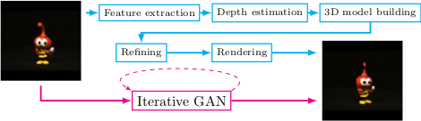

# Iterative GANs for Rotating Visual Objects



Code used in the [paper](https://openreview.net/pdf?id=HJ7rdGkPz), based on code from [Affinelayer](https://github.com/affinelayer/pix2pix-tensorflow), a Tensorflow port of [Pix2pix](https://github.com/phillipi/pix2pix)

## Setup

### Prerequisites
- see requirements.txt

### Recommended
- Linux with Tensorflow GPU edition + cuDNN

### Getting Started

```sh
# clone this repo
git clone https://github.com/...
# download the ALOI dataset (http://aloi.science.uva.nl) and unzip (mask and view, we used half-resolution)
cd <data dir>
wget --ignore-length http://aloi.science.uva.nl/tars/aloi_red2_view.tar
wget --ignore-length http://aloi.science.uva.nl/tars/aloi_mask2.tar
mkdir aloi_red2_view
mkdir aloi_mask2
tar -C aloi_red2_view -xvf
tar -C aloi_mask2 -xvf
# preprocess the data (pad and scale)
cd <code dit>
python preprocess.py <datadir>
python preprocess.py <datadir> mask
```

### Training and testing
```sh
# train the model (this may take 1-5 days depending on GPU, on CPU you will be waiting for a bit)
python gen3d.py \
    --mode train \
    --input_dir <data dir> \
    --output_dir ig6_train \
    --max_epochs 20
# test the model
python gen3d.py \
  --mode test \
  --input_dir <data dir> \
  --output_dir ig6_test \
  --checkpoint ig6_train
  --mmad_loss True \
```

The test run will output an HTML file at `facades_test/index.html` that shows input/output/target/intermediate image sets (WARNING, 3.6k images takes a lot of memory in a browser).
Also outputed is a .npy file, with the \(L_1^M\)-score of the test set, which can be used to compare the models

There are multiple options that create different models
```sh
--sample_lambda <float>   # factor of loss whether to use a second unsupervised discriminator (IG+U)
--between_lambda <float>  # factor of loss whether to use a second supervised discriminator (IG+S)
--mmad_loss <bool>        # whether to use MMAD-loss between generated image and target (IG_M)
# baselines
--baseline [pix2pix|identity|projective]
```
The amount of iterations can be controlled by the data-generator (lines 145-191) with '--datatype', currently impelented:
```sh
basic_train       # normal 30 degrees rotation in 6 steps (28k images per epoch)
basic_train_5deg  # 5 degreees rotation in 1 step (28k images per epoch)
basic_test        # seen and unseen test data of 30 degrees rotation in 6 step (2x 3.6k images)
rotate_test       # seen and unseen test data of 90 degrees rotation in 18 step (2x 3.6k images)
step_wise_train   # increasing the steps from k=1 to k\in{1,...,36} in 3 steps of 5 epoch each
varied_rot_train  # use varied k\in{1,...,36} (28k images per epoch)
very_small        # for testing purpose, 8 images of varied k
very_small_test   # for testing purpose, 8 images of varied k
```

## Citation
If you use this code for your research, please cite the paper: [paper](https://openreview.net/pdf?id=HJ7rdGkPz):

```
@article{galama2018iterative,
  title={Iterative GANs for Rotating Visual Objects},
  author={Galama, Ysbrand and Mensink, Thomas},
  year={2018}
}
```